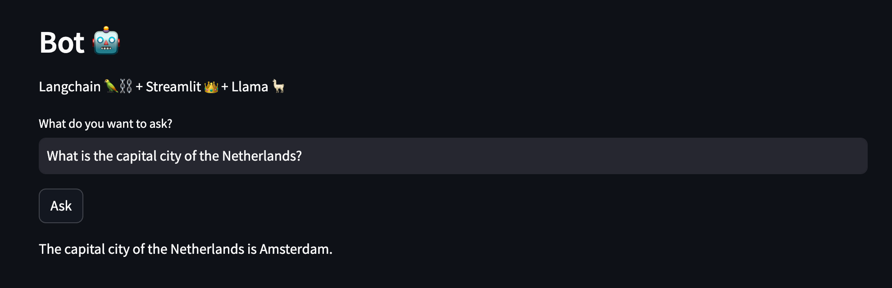

# LLM 🤖

🤖 = Streamlit 👑 + Langchain 🦜️ + LLaMA 🦙

1. **Streamlit:**
   The app is built using [Streamlit](https://streamlit.io/) and allows you to interact with the chatbot.

2. **Langchain:**
   [Langchain](https://python.langchain.com/docs/get_started/introduction.html) Langchain is a framework for developing application powered by language models.

3. **LLaMA:**
   [LLaMA](https://ai.meta.com/blog/large-language-model-llama-meta-ai/) is a LLM from Meta. And powers the chatbot's language generation and understanding abilities.



## Installation

1. Make sure you have [Pyenv](https://github.com/pyenv/pyenv), [Poetry](https://python-poetry.org/), [Task](https://taskfile.dev/#/installation) installed on your system.

2. Clone this repository to your local machine:

   ```bash
   git clone https://github.com/alissadb/chatbot_llm.git
   ```

3. Navigate to the repository directory:

   ```bash
   cd chatbot
   ```

4. This repo uses Task to run task. To set up the local development environment with the required dependencies. Install the local environment:

   ```bash
   task setup-local-env
   ```

## Usage

### Running the 🤖

1. Download a model, for example `Llama-2-7B-Chat-ggml` from Hugging Face ([link](https://huggingface.co/localmodels/Llama-2-7B-Chat-ggml/blob/main/llama-2-7b-chat.ggmlv3.q2_K.bin)) and save it under the `models/` directory.

2. Change the model name in `app.py` in this line

```python
llm_chain = get_llm_chain(model_name="models/llama-2-7b-chat.ggmlv3.q2_K.bin")
```

2. To run the 🤖 run the following command:

```bash
task run-app
```

The app will be accessible at `http://localhost:8501` in your web browser.
